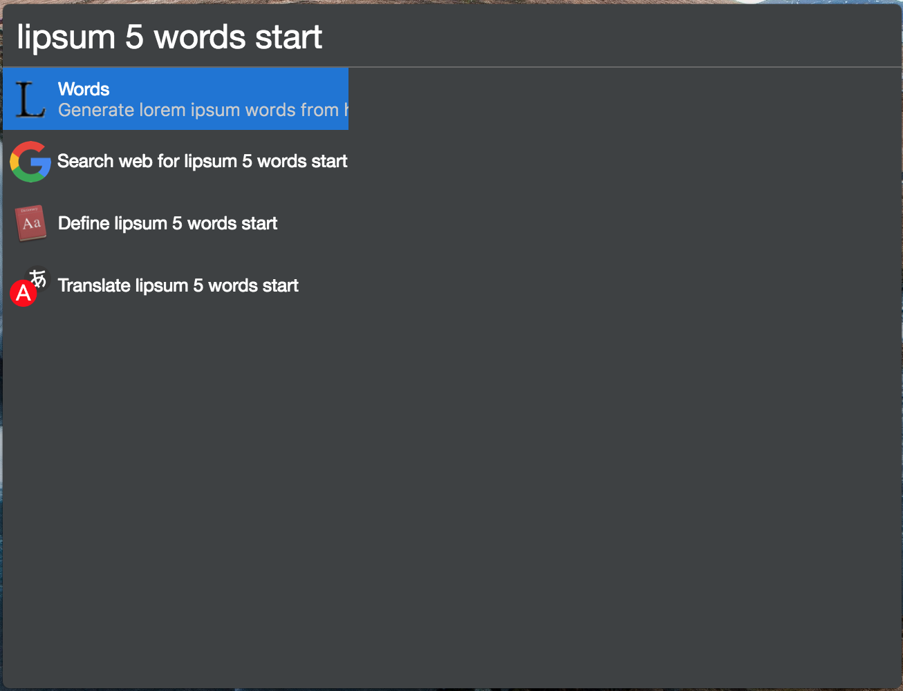

# cerebro-lipsum

> [Cerebro](https://cerebroapp.com) plugin to generate lorem ipsum text from [lipsum.com](http://www.lipsum.com)

## Usage

In Cerebro, type `lispum` and any arguments; select the desired type of output and the text will be copied to the clipboard.

Possible arguments include:
<small>(Arguments can be abbreviated and listed in any order)</small>

* `words`, `paragraphs`, `bytes`, `lists` (the last one listed in the passed in arguments will be used)
* `start`
* Any number (defaults to 5)

## Installing

* Type `plugins lipsum` into Cerebro
* Click `install`

## Motivation

This plugin was inspired by a similar Alfred Workflow.

## Related

- [Cerebro](http://github.com/KELiON/cerebro) – main repo for Cerebro app;

## License

MIT © [Matthew Jacobs](https://www.mattjdev.com)
