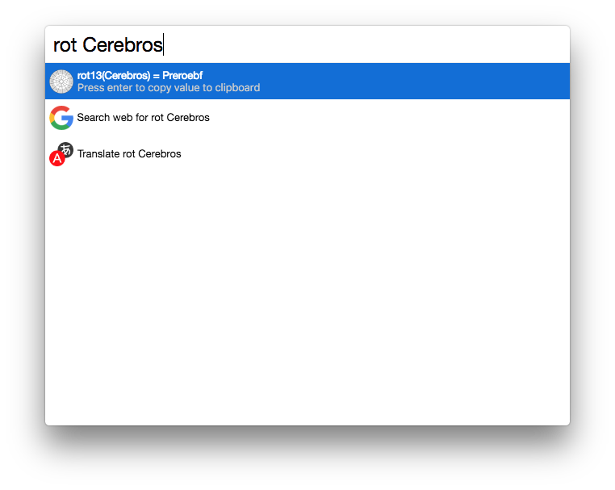

# cerebro-rot13

> [Cerebro](https://cerebroapp.com) plugin to rot13 input

## Usage

In Cerebro, type `rot` to encode your input using rot13(). Use <kbd>⌘+C</kbd> or <kbd>↩</kbd> to copy the encoded value to clipboard.

* `rot [input]`

Ex: `rot example` => `rknzcyr`

This plugin is using the [rot](https://www.npmjs.com/package/rot) node module to encode the data.

 More infos about `rot13` here: [https://wikipedia.org/wiki/ROT13](https://wikipedia.org/wiki/ROT13)

## Installing

* Type `plugins rot` into Cerebro
* Click `install`

## Related

- [Cerebro](http://github.com/KELiON/cerebro) – main repo for Cerebro app;

## License

MIT © [Benoit Zohar](https://github.com/benoitzohar)
